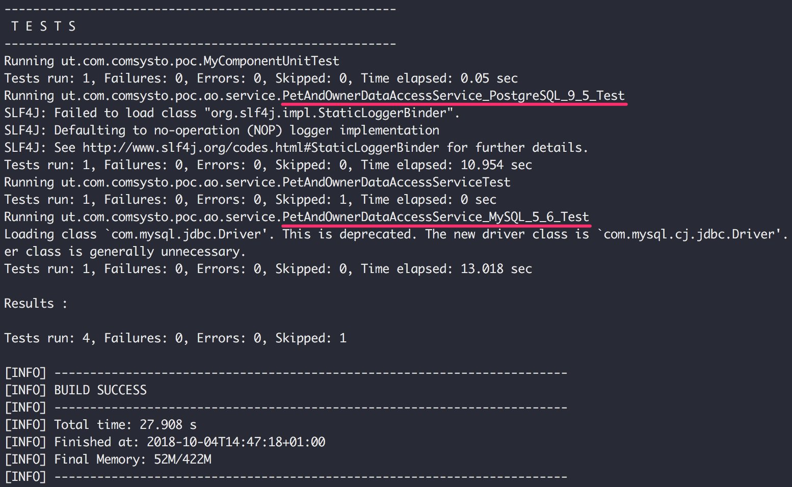

# poc-dockerized-database-integration-tests-atlassian-plugin

A simple Proof of Concept on how to run **Database Integration Tests with real dockerized PostgreSQL or MySQL Databases during Atlassian JIRA Plugin development**.
This PoC is based on **[UnitTests for Active Objects](https://developer.atlassian.com/server/framework/atlassian-sdk/testing/)**. 

&nbsp;

### Prerequisites

 * Docker is installed and on PATH
 * Java 8 JDK is installed and on PATH
 * [Atlassian Plugin SDK](https://developer.atlassian.com/server/framework/atlassian-sdk/set-up-the-atlassian-plugin-sdk-and-build-a-project/) is installed and on PATH

&nbsp;

### Running the Tests

Simply run:

```
atlas-unit-test
```

<p align="center"></p>

&nbsp;

### Classes and Tests

 * Businss Logic
   * [**`OwnerEntity`**](https://github.com/comsysto/poc-dockerized-database-integration-tests-atlassian-plugin/blob/master/src/main/java/com/comsysto/poc/ao/model/OwnerEntity.java) = Active Objects Entity
   * [**`PetEntity`**](https://github.com/comsysto/poc-dockerized-database-integration-tests-atlassian-plugin/blob/master/src/main/java/com/comsysto/poc/ao/model/PetEntity.java) = Active Objects Entity
   * [**`PetAndOwnerDataAccessService`**](https://github.com/comsysto/poc-dockerized-database-integration-tests-atlassian-plugin/blob/master/src/main/java/com/comsysto/poc/ao/service/PetAndOwnerDataAccessService.java) = Data Access API works with EntityManager 
 * Tests  
   * [**`PetAndOwnerDataAccessServiceTest`**](https://github.com/comsysto/poc-dockerized-database-integration-tests-atlassian-plugin/blob/master/src/test/java/ut/com/comsysto/poc/ao/service/PetAndOwnerDataAccessServiceTest.java) = Base test whose test methods are used by every specific database engine test
   * [**`PetAndOwnerDataAccessService_MySQL_5_6_Test`**](https://github.com/comsysto/poc-dockerized-database-integration-tests-atlassian-plugin/blob/master/src/test/java/ut/com/comsysto/poc/ao/service/PetAndOwnerDataAccessService_MySQL_5_6_Test.java) = Test that runs against dockerized MySQL 5.6
   * [**`PetAndOwnerDataAccessService_PostgreSQL_9_5_Test`**](https://github.com/comsysto/poc-dockerized-database-integration-tests-atlassian-plugin/blob/master/src/test/java/ut/com/comsysto/poc/ao/service/PetAndOwnerDataAccessService_PostgreSQL_9_5_Test.java) = Test that runs against dockerized PostgreSQL 9.5
 * Test Config
   * [**`Dockerized_MySQL_5_6_JdbcConfig`**](https://github.com/comsysto/poc-dockerized-database-integration-tests-atlassian-plugin/blob/master/src/test/java/ut/com/comsysto/poc/ao/service/jdbc/Dockerized_MySQL_5_6_JdbcConfig.java) = Test Config contains code to start docker container and JDBC Config for test
   * [**`Dockerized_Postgres_9_5_JdbcConfig`**](https://github.com/comsysto/poc-dockerized-database-integration-tests-atlassian-plugin/blob/master/src/test/java/ut/com/comsysto/poc/ao/service/jdbc/Dockerized_Postgres_9_5_JdbcConfig.java) = Test Config contains code to start docker container and JDBC Config for test
&nbsp;

### Distinctions

 * Why not `atlas-integration-test`? 
   * Because even though it is named 'integration-test' it starts a full JIRA instance
and runs tests against it. We only want to instantiate Active Objects with a real database and not the whole JIRA context.
That is why we use the `atlas-unit-test` command.
 * Why not use `DynamicJdbcConfiguration` Annotation and System properties or maven profiles?
   * There are already many examples in the web on how to do that. I wanted to show another way.
 * Why not use `@ManyToOne` Annotations?
   * You can do that if you want a **Left Join**
   * The PoC wants to show how to perform an **Inner Join** 


&nbsp;

### License

[MIT](./LICENSE) © [Comsysto Reply GmbH](https://comsystoreply.de)