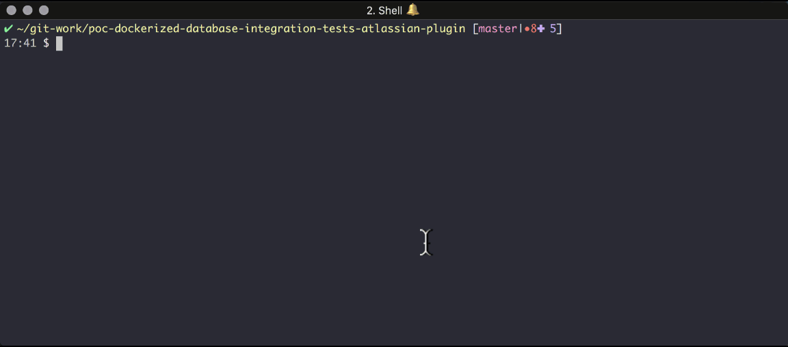
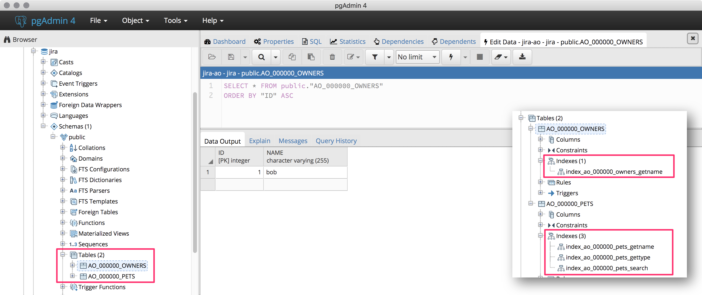

# poc-dockerized-database-integration-tests-atlassian-plugin

A simple Proof of Concept on how to run **Database Integration Tests with real dockerized PostgreSQL or MySQL Databases during Atlassian JIRA Plugin development**.
This PoC is based on **[UnitTests for Active Objects](https://developer.atlassian.com/server/framework/atlassian-sdk/testing/)**.

&nbsp;

### Prerequisites

 * Docker is installed and on PATH
 * Java 8 JDK is installed and on PATH
 * [Atlassian Plugin SDK](https://developer.atlassian.com/server/framework/atlassian-sdk/set-up-the-atlassian-plugin-sdk-and-build-a-project/) is installed and on PATH

&nbsp;

### Running the Tests

We can run the same test against different database engines.

&nbsp;

##### Run tests against embedded HSQLDB

```
atlas-unit-test
```

&nbsp;

##### Run tests against dockerized PostgreSQL

(1) Start dockerized PostgreSQL database

```
docker run --name postgres95 \
           -d --rm -p 5441:5432 \
           -e POSTGRES_PASSWORD=jira \
           -e POSTGRES_USER=jira \
           -e POSTGRES_DB=jira \
           postgres:9.5 \
           postgres -c 'log_statement=all'
```

(2) Run tests against it

```
atlas-unit-test -Dao.test.database=postgres \
                -Ddb.url=jdbc:postgresql://localhost:5441/jira  \
                -Ddb.schema=public \
                -Ddb.username=jira \
                -Ddb.password=jira
```

<p align="center"></p>

We can see the **tables and indexes**:

<p align="center"></p>

(3) See logged queries

```
docker logs postgres95
```

(4) Shutdown dockerized PostgreSQL database.

```
docker kill postgres95
```


&nbsp;

##### Run tests against dockerized MySQL

(1) Start dockerized MySQL database

```
docker run --name mysql56 \
           -d --rm \
           -p 3316:3306 \
           -e MYSQL_RANDOM_ROOT_PASSWORD=true \
           -e MYSQL_USER=jira  \
           -e MYSQL_PASSWORD=jira  \
           -e MYSQL_DATABASE=jira  \
           mysql:5.6
```

(2) Run tests against it

```
atlas-unit-test -Dao.test.database=mysql \
                -Ddb.url=jdbc:mysql://localhost:3316/jira?autoReconnect=true  \
                -Ddb.username=jira \
                -Ddb.password=jira
```

  * Note that MySQL uses no so called "schema". So we skip the definition.

(3) Shutdown dockerized MySQL database.

```
docker kill mysql56
```

&nbsp;

### Classes and Tests

 * Businss Logic
   * [**`OwnerEntity`**](https://github.com/comsysto/poc-dockerized-database-integration-tests-atlassian-plugin/blob/master/src/main/java/com/comsysto/poc/ao/model/OwnerEntity.java) = Active Objects Entity
   * [**`PetEntity`**](https://github.com/comsysto/poc-dockerized-database-integration-tests-atlassian-plugin/blob/master/src/main/java/com/comsysto/poc/ao/model/PetEntity.java) = Active Objects Entity
   * [**`PetAndOwnerDataAccessServiceImpl`**](https://github.com/comsysto/poc-dockerized-database-integration-tests-atlassian-plugin/blob/master/src/main/java/com/comsysto/poc/ao/service/PetAndOwnerDataAccessServiceImpl.java) = Data Access API works with ActiveObjects
 * Test  
   * [**`PetAndOwnerDataAccessServiceTest`**](https://github.com/comsysto/poc-dockerized-database-integration-tests-atlassian-plugin/blob/master/src/test/java/ut/com/comsysto/poc/ao/service/PetAndOwnerDataAccessServiceTest.java) = Base test whose test methods are run against different database engines

&nbsp;

### Distinctions

 * Why not `atlas-integration-test`?
   * Because even though it is named 'integration-test' it starts a full JIRA instance
and runs tests against it. We only want to instantiate Active Objects with a real database and not the whole JIRA context.
That is why we use the `atlas-unit-test` command.
 * Why not use `@ManyToOne` Annotations?
   * You can do that if you want a **Left Join**
   * The PoC wants to show how to perform an **Inner Join**


&nbsp;

### License

[MIT](./LICENSE) © [Comsysto Reply GmbH](https://comsystoreply.de)
