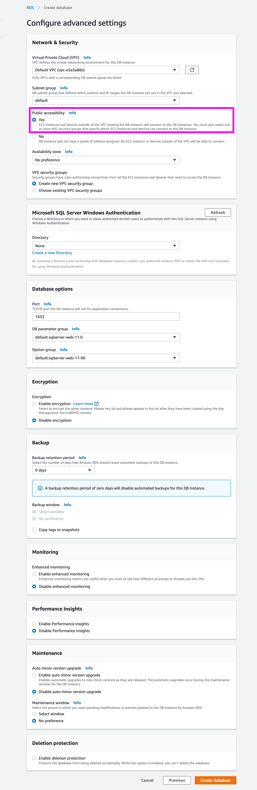

# Running atlas-unit-test against Microsoft SQL Server 2012

### (1) Setup a Microsoft SQL Server 2012 instance on AWS

Since MSSQL 2012 requires a license, it is the easiest way to set it up on AWS.

Simply go to RDS and create a Database like so:





:bangbang: Make sure that the AWS SecurityGroup of the DB allows incoming traffic.

&nbsp;

----

&nbsp;

### (2) Creating Jira User and Database

Connect to the MSSQL Database with the master user and master password with a tool like
[TablePlus](https://tableplus.io/) or any other tool.

Execute the following commands as described in [Connecting Jira to MSSQL Server 2012](https://confluence.atlassian.com/adminjiraserver/connecting-jira-applications-to-sql-server-2012-938846858.html)

```sql
CREATE DATABASE jiradb COLLATE SQL_Latin1_General_CP437_CI_AI;

--- Then conect to jiradb (in TablePlus press CMD+K)
CREATE SCHEMA jiraschema;
CREATE LOGIN jiradbuser WITH PASSWORD = 'jiraSuperPassword';
CREATE USER jiradbuser WITH DEFAULT_SCHEMA = jiraschema;
SET NOCOUNT ON;
ALTER DATABASE jiradb SET READ_COMMITTED_SNAPSHOT ON;
ALTER LOGIN jiradbuser with DEFAULT_DATABASE = jiradb;

--- make jiradb owner
EXEC sp_addrolemember 'db_owner', 'jiradbuser'

-- additional permissions
GRANT insert TO jiradbuser;
GRANT select TO jiradbuser;
GRANT delete TO jiradbuser;
GRANT update TO jiradbuser;
GRANT CREATE TABLE  TO jiradbuser;
GRANT CREATE VIEW  TO jiradbuser;
ALTER AUTHORIZATION ON SCHEMA::jiraschema to jiradbuser;
```


&nbsp;

----

&nbsp;

### (3) Get MSSQL JDBC Driver

Microsoft provides this officially via maven central :)

We later simply add a dependency to our pom.xml.
Nothing to do here.


&nbsp;

----

&nbsp;

### (4) Clone the test project and add MSSQL JDBC Driver


```
git clone https://github.com/comsysto/poc-dockerized-database-integration-tests-atlassian-plugin.git
cd poc-dockerized-database-integration-tests-atlassian-plugin
```

Now add this to `pom.xml`:

```
<dependency>
    <groupId>com.microsoft.sqlserver</groupId>
    <artifactId>mssql-jdbc</artifactId>
    <version>7.2.1.jre8</version>
    <scope>test</scope>
</dependency>
```

&nbsp;

----

&nbsp;

### (5) Run atlas-unit-test against MSSQL

Now make sure you have the latest Atlassian SDK installed an run (with your settings):

```
atlas-unit-test -Ddb.url="jdbc:sqlserver://mssql2012.XXXX.eu-central-1.rds.amazonaws.com:1433"  \
                -Ddb.schema=jiraschema \
                -Ddb.username=jiradbuser \
                -Ddb.password=jiraSuperPassword
```