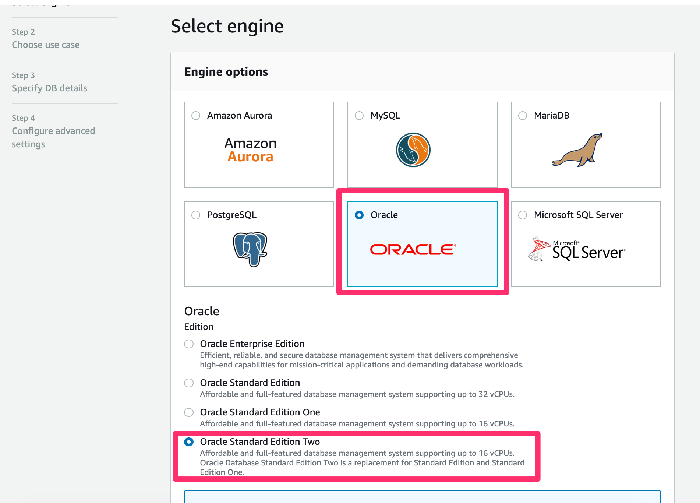
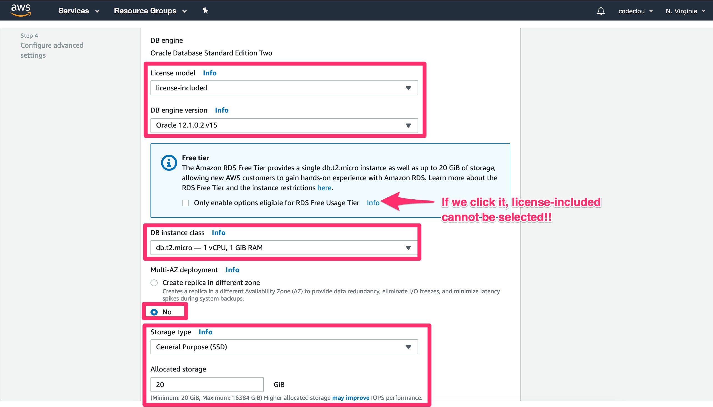
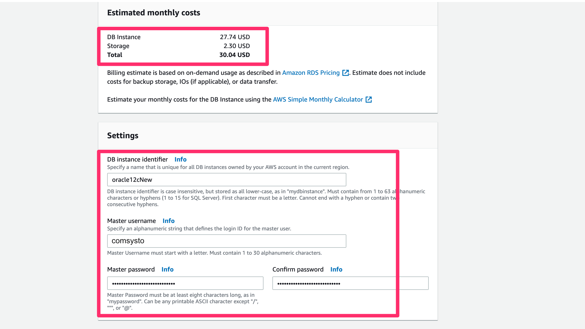
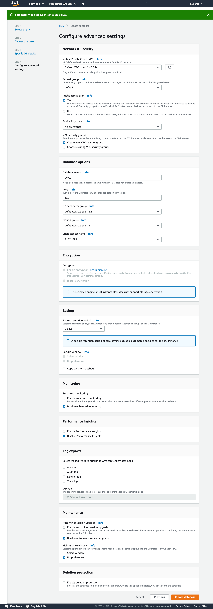

# Running atlas-unit-test against Oracle 12c

### (1) Setup an Oracle 12c instance on AWS

Since Oracle 12c requires a license, it is the easiest way to set it up on AWS.

Simply go to RDS and create a Database like so:









:bangbang: Make sure that the AWS SecurityGroup of the DB allows incoming traffic.

&nbsp;

----

&nbsp;

### (2) Creating Jira User and Database

Connect to the Oracle Database with the master user and master password with a tool like
[TablePlus](https://tableplus.io/) or any other tool.

Execute the following commands as described in [Connecting Jira to Oracle 12c](https://confluence.atlassian.com/adminjiraserver073/connecting-jira-applications-to-oracle-861253045.html)

```sql
-- The default tablespace on RDS is "USERS"
create user jirau identified by jiraSuperPassword default tablespace USERS quota unlimited on USERS;
grant connect to jirau;
grant create table to jirau;
grant create sequence to jirau;
grant create trigger to jirau;
```


&nbsp;

----

&nbsp;

### (3) Get Oracle JDBC Driver

Download the `ojdbc8.jar` in version 12.2.0.1 from oracle.com.

Install the dependecy locally on your machine:

```
mvn install:install-file -Dfile=/Users/foo/ojdbc8.jar -DgroupId=oracle -DartifactId=ojdbc8 -Dversion=12.2.0.1
```


&nbsp;

----

&nbsp;

### (4) Clone the test project and add Oracle JDBC Driver


```
git clone https://github.com/comsysto/poc-dockerized-database-integration-tests-atlassian-plugin.git
cd poc-dockerized-database-integration-tests-atlassian-plugin
```

Now add this to `pom.xml`:

```
<dependency>
    <groupId>oracle</groupId>
    <artifactId>ojdbc8</artifactId>
    <version>12.2.0.1</version>
    <scope>test</scope>
</dependency>
```

&nbsp;

----

&nbsp;

### (5) Run atlas-unit-test against Oracle

Now make sure you have the latest Atlassian SDK installed an run (with your settings):


```
# do not use ao.test.datababse !!!
atlas-unit-test -Ddb.url=jdbc:oracle:thin:@//oracle12cnew.XXXXX.eu-central-1.rds.amazonaws.com:1521/ORCL  \
                -Ddb.schema=jirau \
                -Ddb.username=jirau \
                -Ddb.password=jiraSuperPassword
```

